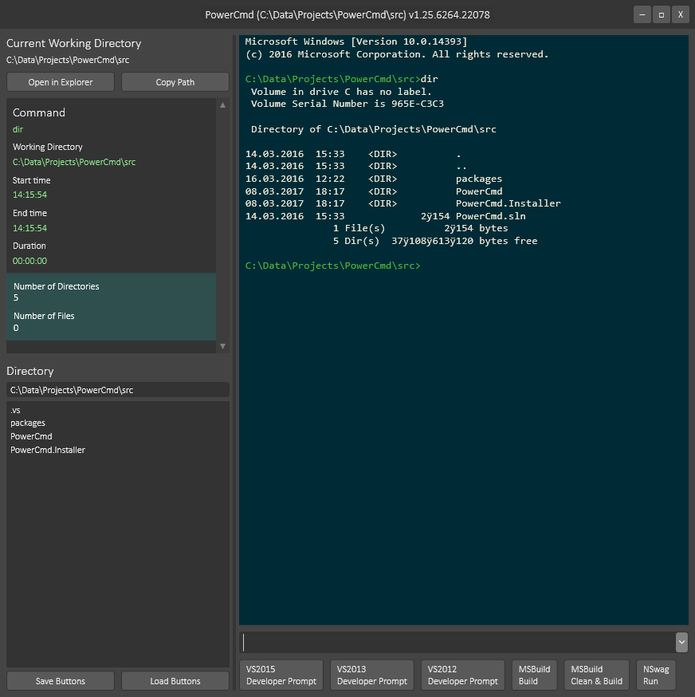

# PowerCmd

PowerCmd is a replacement for the native Windows Prompt with enhanced performance and additional features. The tool greatly improves script execution performance with optimized output rendering and adds features like output analysis, command buttons, improved suggestions and project directories. 

#### [Download latest PowerCmd MSI installer](http://rsuter.com/Projects/PowerCmd/installer.php)

[Download latest **Build Artifacts** from AppVeyor](https://ci.appveyor.com/project/rsuter/powercmd/build/artifacts)

